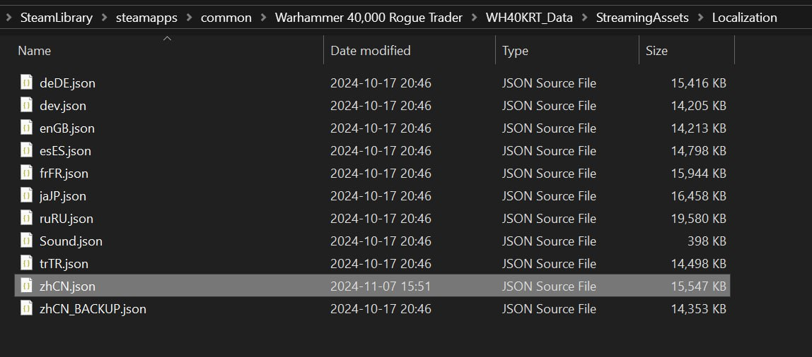
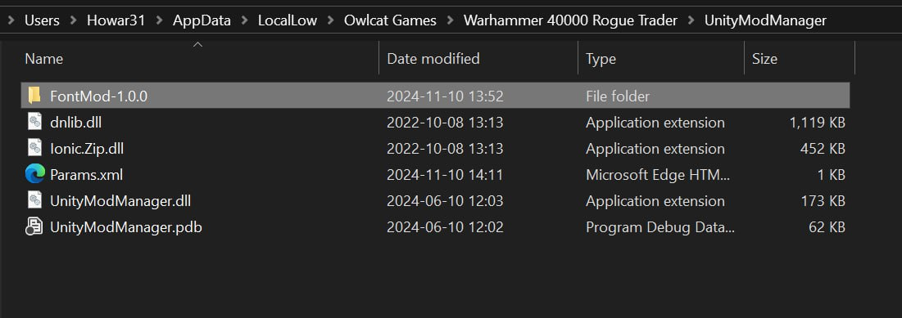
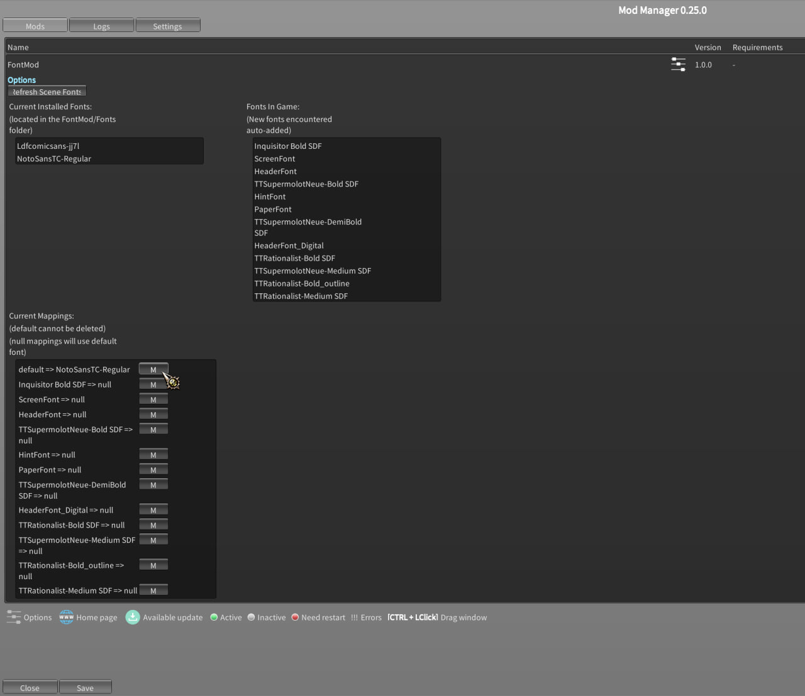

# 戰鎚 40K 行商浪人 繁體中文計畫

## 說明

官方目前只支援簡體中文，且內建的字體無法顯示部分繁體中文，因此除了繁簡轉換以外，還需要安裝字體模組才能正確顯示繁體中文。

## 使用方式

### 安裝翻譯字串

1. 下載 `zhCN.json` 檔案
2. 複製到遊戲安裝目錄 `%SteamLibrary%\steamapps\common\Warhammer 40,000 Rogue Trader\WH40KRT_Data\StreamingAssets\Localization` 下並覆蓋 (建議可先備份原始檔案)
  

### 安裝字體模組

此專案內沒有包含字體模組，字體模組由 [thehambeard/FontMod](https://github.com/thehambeard/FontMod/) 製作與提供

1. 下載字體模組 [FontMod](https://github.com/thehambeard/FontMod/releases/tag/1.0.0)
2. 將解壓縮的資料夾「FontMod-1.0.0」放到遊戲目錄下 `%USERPROFILE%\AppData\LocalLow\Owlcat Games\Warhammer 40000 Rogue Trader\UnityModManager\`
  
3. 下載 [NotoSansCJKtc-Regular.ttf](NotoSansCJKtc-Regular.ttf) 字體檔案 (或任何喜歡的字體)
4. 將字體並放 FontMod 資料夾內的 `Fonts` 資料夾下 (完整路徑為 `%USERPROFILE%\AppData\LocalLow\Owlcat Games\Warhammer 40000 Rogue Trader\UnityModManager\FontMod-1.0.0\Fonts\`)

### 在遊戲中啟用繁體中文

1. 開啟遊戲，在遊戲主選單 > 設置 > 遊戲設置 > 語言中選擇「繁體中文」
2. 按 Ctrl + F10 (或主選單 > DLC與模組 > 模組 > 已安裝模組 > FontMod 右邊的齒輪) 開啟 Unity Mod Manager
3. 點開 FontMod ，並在下方 Current Mappings 中的 default 按右邊的 M 按鈕，選擇字體
    
4. FontMod 設定上方有一個「Refresh Scene Fonts」按鈕，點選後會重新載入字體
5. 在 Unity Mod Manager 點選 Save

## 注意事項

- 使用此翻譯會覆蓋掉原本官方的簡體中文選項 (變為「繁體中文」)

---

This is a project to translate Warhammer 40,000: Rogue Trader into Traditional Chinese.  Thanks for the help from [thehambeard/FontMod](https://github.com/thehambeard/FontMod/) to change the font to display Traditional Chinese.
