# 戰鎚 40K 行商浪人 繁體中文計畫

- [戰鎚 40K 行商浪人 繁體中文計畫](#戰鎚-40k-行商浪人-繁體中文計畫)
  - [說明與展示](#說明與展示)
  - [使用方式](#使用方式)
    - [安裝翻譯字串](#安裝翻譯字串)
    - [安裝字體模組](#安裝字體模組)
    - [在遊戲中啟用繁體中文](#在遊戲中啟用繁體中文)
  - [注意事項](#注意事項)

## 說明與展示

官方目前只支援簡體中文，且內建的字體無法顯示部分繁體中文，因此除了繁簡轉換以外，還需要安裝字體模組才能正確顯示繁體中文。

此翻譯字串並非單純繁簡體轉換，其中有將部分字串做調整以符合繁體中文的習慣，若發現翻譯錯誤或有更好的建議，歡迎提出 issue 或 pull request。

此翻譯版本為 Rogue Trader 1.4.1.231

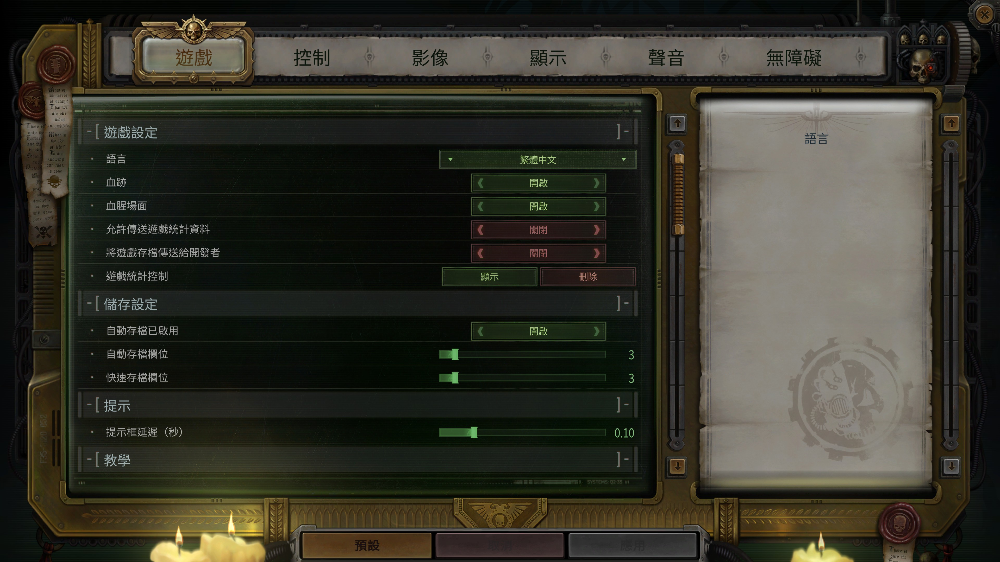
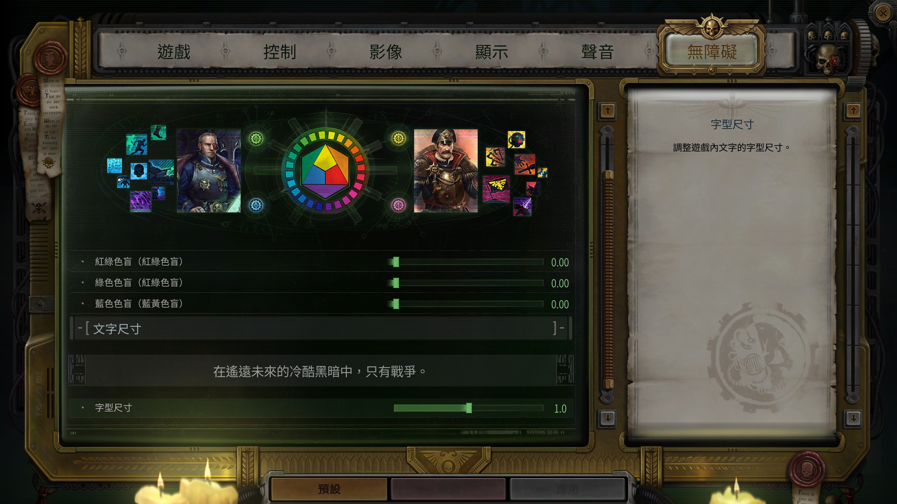
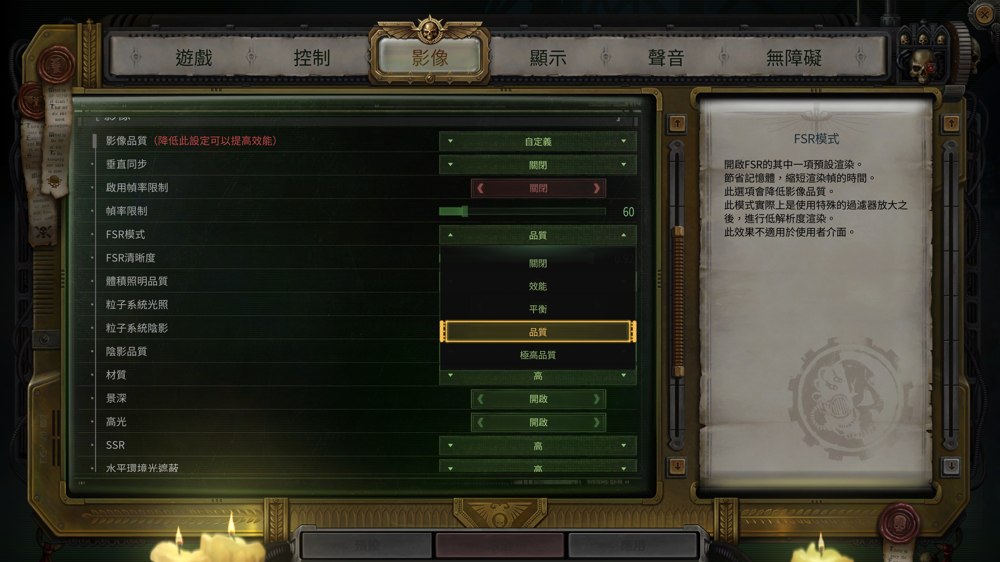
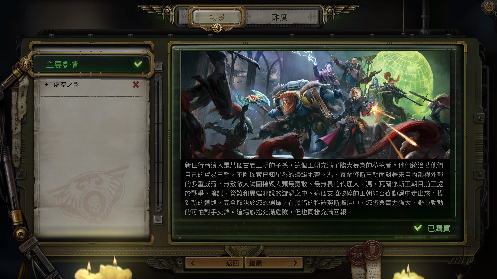
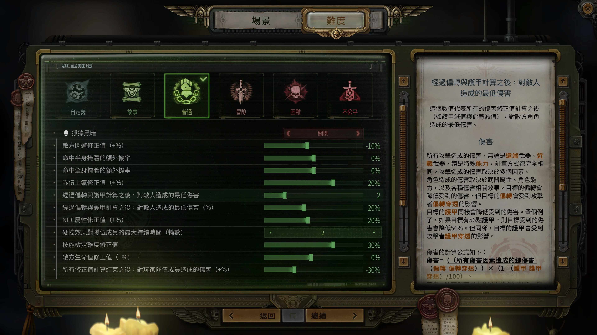
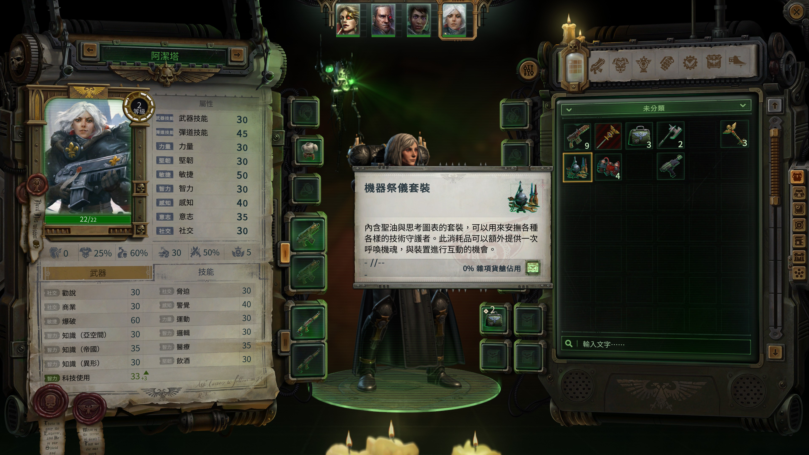
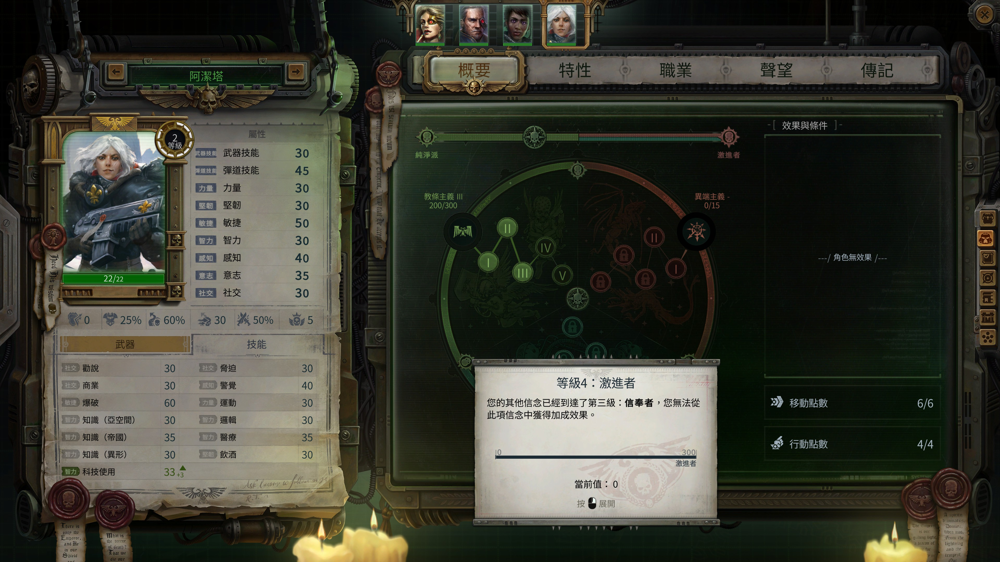
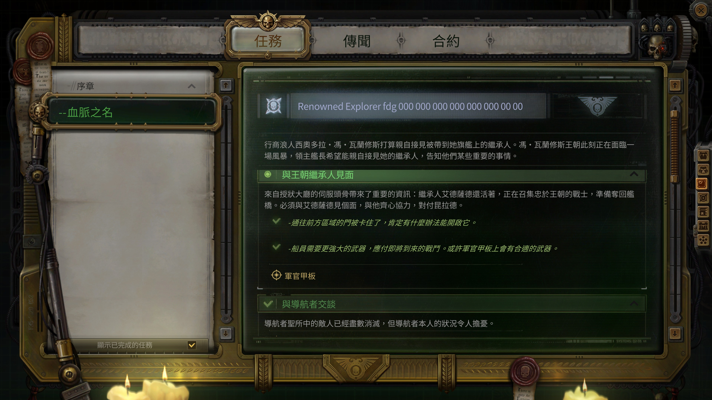
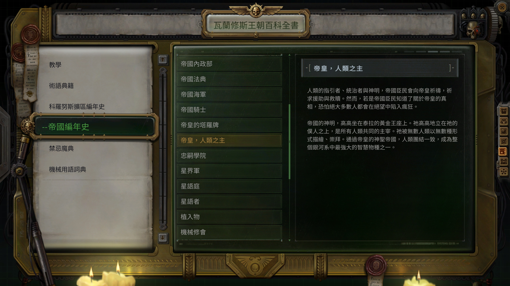
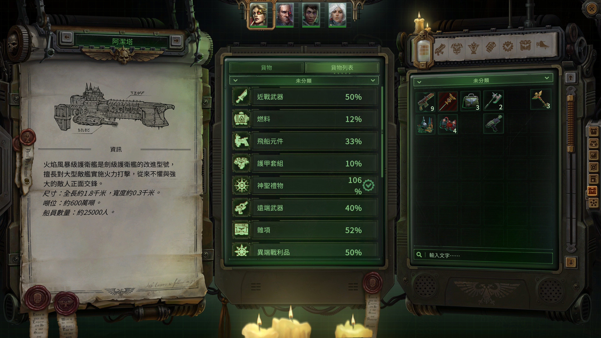
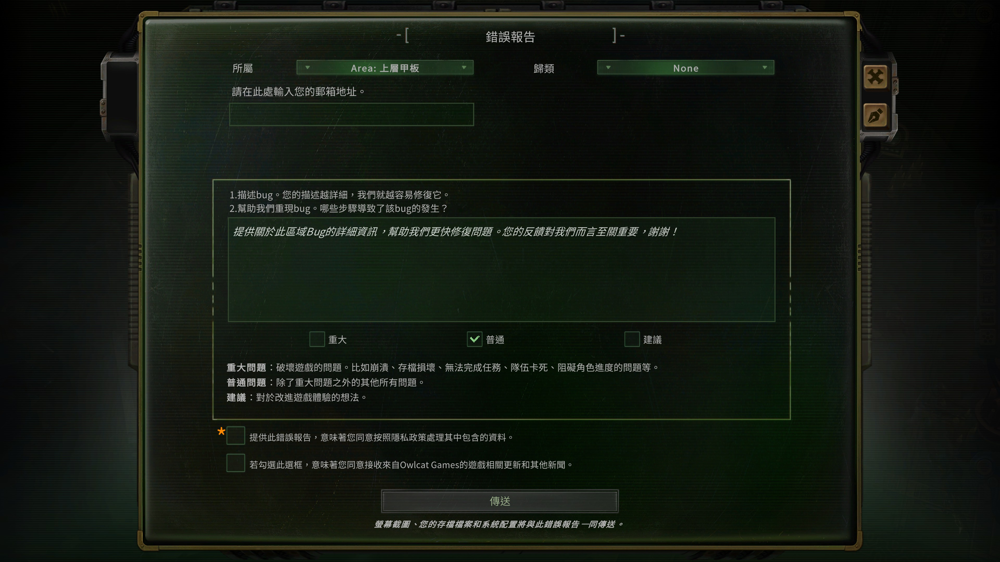

## 使用方式

請按照步驟依序安裝翻譯字串、字體模組、以及遊戲內相關設定

### 安裝翻譯字串

1. 下載 [zhCN.json](./WH40KRT_Data/StreamingAssets/Localization/zhCN.json) 檔案
2. 複製到遊戲安裝目錄下並覆蓋  
   (完整路徑為 `%SteamLibrary%\steamapps\common\Warhammer 40,000 Rogue Trader\WH40KRT_Data\StreamingAssets\Localization`)
   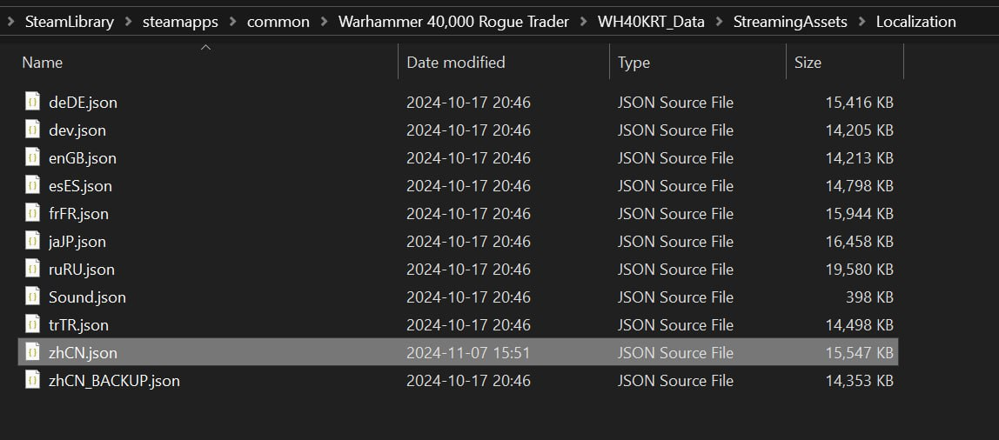  
   (建議可先備份原始檔案)

### 安裝字體模組

此專案內沒有包含字體模組，字體模組由 [thehambeard/FontMod](https://github.com/thehambeard/FontMod/) 製作與提供

1. 下載字體模組 [FontMod](https://github.com/thehambeard/FontMod/releases)
> 提示：請至 FontMod 的 Releases 頁面（上方連結）確認並下載最新版本（以 Release 標記或帶版本號的檔案為主）。以下僅用 1.0.0 作為範例。
2. 將解壓縮的資料夾「FontMod-1.0.0」放到遊戲目錄下  
   (完整路徑為 `%USERPROFILE%\AppData\LocalLow\Owlcat Games\Warhammer 40000 Rogue Trader\UnityModManager\`)
   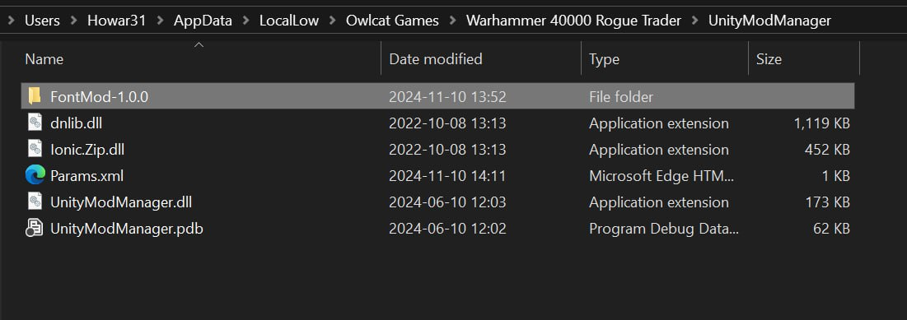
3. 下載 [NotoSansCJKtc-Regular.ttf](./NotoSansCJKtc-Regular.ttf) 字體檔案 (或任何喜歡的字體)
4. 將字體並放 FontMod 資料夾內的 `Fonts` 資料夾下  
   (完整路徑為 `%USERPROFILE%\AppData\LocalLow\Owlcat Games\Warhammer 40000 Rogue Trader\UnityModManager\FontMod-1.0.0\Fonts\`)

### 在遊戲中啟用繁體中文

1. 開啟遊戲，在遊戲主選單 > 設置 (Settings) > 遊戲設置 (Game Settings) > 語言 (Language) 中選擇「繁體中文」(安裝完成前可能顯示為简体中文)
2. 開啟 Unity Mod Manager
   - 按 `Ctrl` + `F10`
   - 或主選單 > DLC與模組 (DLCs and Mods) > 模組 (Mods) > 已安裝模組 (Installed mods) > FontMod 右邊的齒輪
3. 點開 FontMod ，並在下方 Current Mappings 中的 default 按右邊的 M 按鈕，選擇字體
   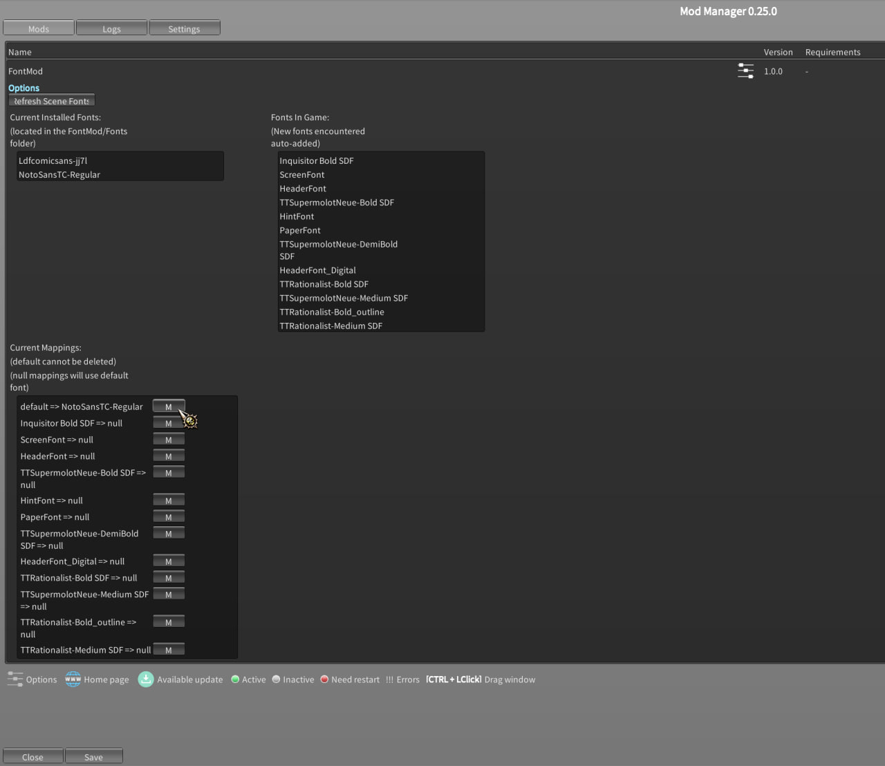
4. FontMod 設定上方有一個「Refresh Scene Fonts」按鈕，點選後會重新載入字體
5. 在 Unity Mod Manager 點選 Save 後點選 Close 關閉

## 注意事項

- 注意！此遊戲使用任何模組 (包含本篇提到的字體模組) 都會造成遊戲的成就無法解鎖
  - 單純使用翻譯 json 字串不會影響成就解鎖，但不裝字體模組會有部分繁體中文無法正確顯示
  - 若要使用模組並同時能解鎖成就，可以使用 [ToyBox](https://www.nexusmods.com/warhammer40kroguetrader/mods/1) 或 [Allow Modded Achievements](https://www.nexusmods.com/warhammer40kroguetrader/mods/4) 來啟用成就
- 使用此翻譯會覆蓋掉原本官方的簡體中文選項 (變為繁體中文)
- 遊戲本體自帶 Unity Mod Manager，不需額外安裝
- 使用此翻譯後，因為動態生成或是節省資源的緣故，仍會有部分字串不在翻譯範圍內，包含:
  - 開場的警告訊息，因為模組未載入，所以無法正確顯示繁體中文
  - 主選單右下角的公告是官方動態訊息
  - 設定非選擇简体中文 (zhCN) 時，語言選項會顯示為「简体中文」

---

This is a project to translate Warhammer 40,000: Rogue Trader into Traditional Chinese.  Thanks for the help from [thehambeard/FontMod](https://github.com/thehambeard/FontMod/) to change the font to display Traditional Chinese.
